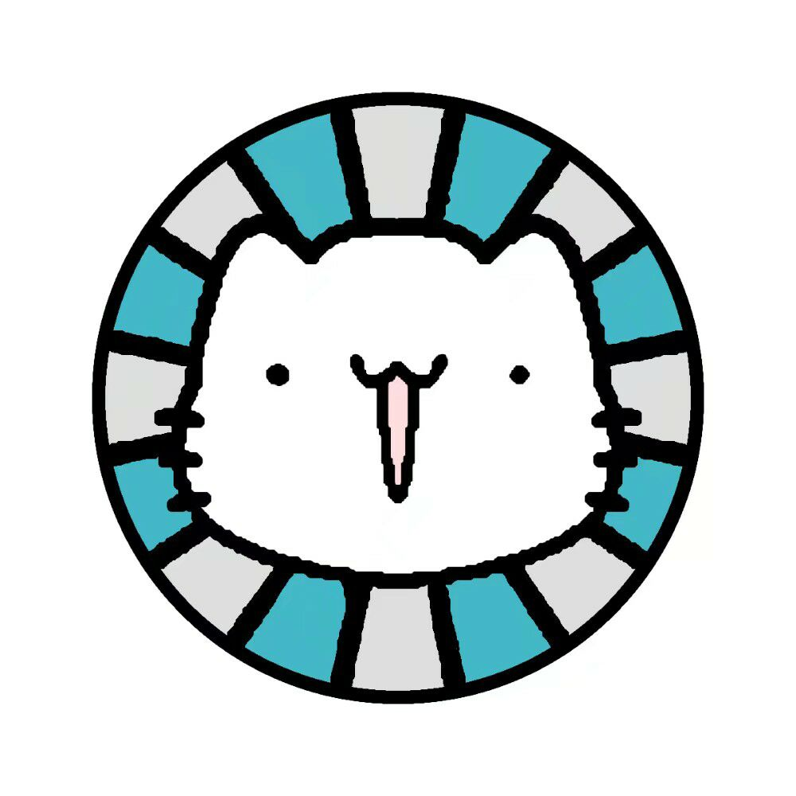

# Mai-Kook-DX

maimai bot for [KOOK](https://www.kookapp.cn/)

Based on [Diving-Fish/mai-bot](https://github.com/Diving-Fish/mai-bot) and [TWT233/khl.py](https://github.com/TWT233/khl.py)

## Disclaimer

This repository, the Mai-Kook-DX project, and other related repositories and projects are purely for python studying and interest, and any commercial uses are strictly prohibited. 

Of course, if there is copyright infringement, you can contact me to delete this repository.

## Introduction (TL;DR)

*skip to [Usage](https://github.com/HDEnt327/Mai-Kook-DX#usage) to run Mai-Kook-DX on your own machine*

This is a KOOK Bot for maimai related functionality, based on the mai-bot project

Certain functionality may differ from the original mai-bot

> For example, in the original mai-bot, when `b40` is sent, the bot looks for the user's QQ number, and asks the database from *Diving-Fish* for the prober id, and uses the prober id to gather data to generate the b40 image.

> However, for Mai-Kook-DX, users will need to `/bind` their prober id first, the bot will save the user's KOOK id and prober id locally, the next time the user sends `/b40`, the bot will look for the user's prober id bound to their KOOK id, then asks data from the *Diving-Fish* database.

> Other functionality may also differ, you can check the code or /phelp to look for specific instructions

## Usage

Follow instructions on [TWT233/khl.py](https://github.com/TWT233/khl.py) to install khl.py

Download the Mai-Kook-DX code through GitHub as a ZIP an unzip the code anywhere

Refer to [Diving-Fish/mai-bot](https://github.com/Diving-Fish/mai-bot) to download source files

> source files are only for study purposes, please delete them in less than 24 hours

Fill in config.json with your KOOK Bot token

Run bot.py, and you're good to go!

Invite your bot to a server, send `/phelp`, and it should reply the help menu

## License

### MIT License

Copyright (c) 2023 HDEnt

Permission is hereby granted, free of charge, to any person obtaining a copy
of this software and associated documentation files (the "Software"), to deal
in the Software without restriction, including without limitation the rights
to use, copy, modify, merge, publish, distribute, sublicense, and/or sell
copies of the Software, and to permit persons to whom the Software is
furnished to do so, subject to the following conditions:

The above copyright notice and this permission notice shall be included in all
copies or substantial portions of the Software.

THE SOFTWARE IS PROVIDED "AS IS", WITHOUT WARRANTY OF ANY KIND, EXPRESS OR
IMPLIED, INCLUDING BUT NOT LIMITED TO THE WARRANTIES OF MERCHANTABILITY,
FITNESS FOR A PARTICULAR PURPOSE AND NONINFRINGEMENT. IN NO EVENT SHALL THE
AUTHORS OR COPYRIGHT HOLDERS BE LIABLE FOR ANY CLAIM, DAMAGES OR OTHER
LIABILITY, WHETHER IN AN ACTION OF CONTRACT, TORT OR OTHERWISE, ARISING FROM,
OUT OF OR IN CONNECTION WITH THE SOFTWARE OR THE USE OR OTHER DEALINGS IN THE
SOFTWARE.
