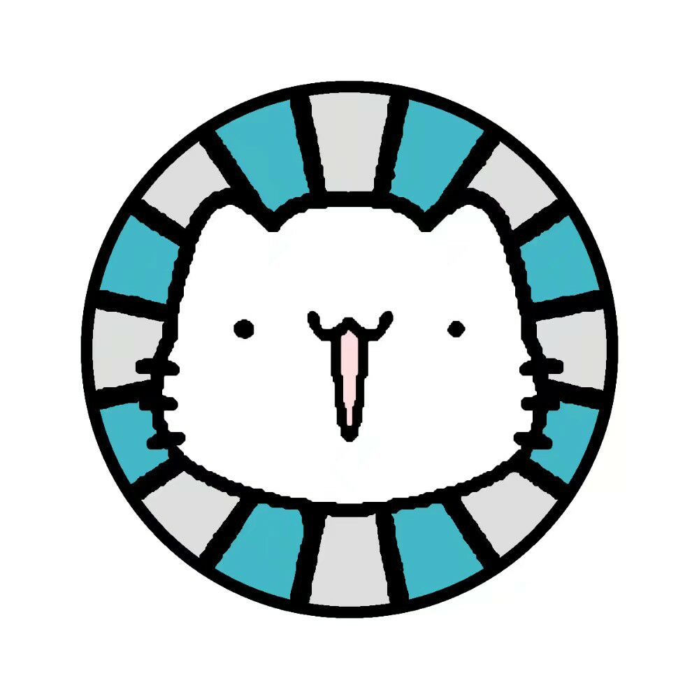

# Mai-Kook-DX

maimai bot for [KOOK](https://www.kookapp.cn/)

Based on [Diving-Fish/mai-bot](https://github.com/Diving-Fish/mai-bot) and [TWT233/khl.py](https://github.com/TWT233/khl.py)

## Disclaimer

This repository, the Mai-Kook-DX project, and other related repositories and projects are purely for python studying and interest, and any commercial uses are strictly prohibited. 

Of course, if there is copyright infringement, you can contact me to delete this repository.

## Introduction (TL;DR)

*skip to [Usage](https://github.com/HDEnt327/Mai-Kook-DX#usage) to run Mai-Kook-DX on your own machine*

This is a KOOK Bot for maimai related functionality, based on the mai-bot project

Certain functionality may differ from the original mai-bot

> For example, in the original mai-bot, when `b40` is sent, the bot looks for the user's QQ number, and asks the database from *Diving-Fish* for the prober id, and uses the prober id to gather data to generate the b40 image.

> However, for Mai-Kook-DX, users will need to `/bind` their prober id first, the bot will save the user's KOOK id and prober id locally, the next time the user sends `/b40`, the bot will look for the user's prober id bound to their KOOK id, then asks data from the *Diving-Fish* database.

> Other functionality may also differ, you can check the code or /phelp to look for specific instructions

## Usage

1. Download the Mai-Kook-DX code through GitHub as a ZIP an unzip the code anywhere

2. Open and cmd/terminal window and run `pip install -r requirements.txt`

> If one or two don't install sucessfully, still try finishing the steps and run the bot, it should stil work ok

> If it doesn't you may have to troubleshoot a bit and get the packages installed

> Most important ones should be PIL and khl.py

3. Refer to [Diving-Fish/mai-bot](https://github.com/Diving-Fish/mai-bot) to download source files

> source files are only for study purposes, please delete them in less than 24 hours

4. Fill in config.json with your KOOK Bot token

5. Run bot.py, and you're good to go!

6. Invite your bot to a server, send `/mhelp`, and it should reply the help menu

## License

### MIT License

The code in this repository is licensed under the MIT license
